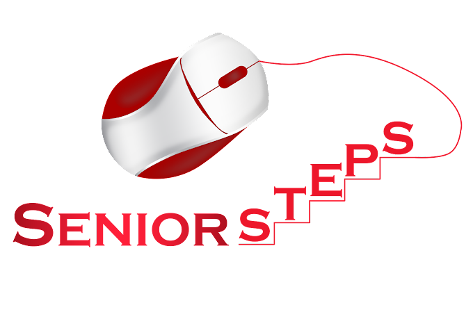
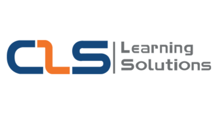

<h1 align="center" style="font-family:Arial, Helvetica, sans-serif">Experiences</h1>

## alx_africa
### AWS Cloud Computing Program (May 2023 - Feb 2024) (4 Months Soft Skills & 6 Months Program)

  &nbsp&nbsp&nbsp

- Worked on improving soft skills via attending alx hubs and interacting with fellow peers to complete weekly milestones.
- Completed the AWS Academy Cloud Foundations course provided by AWS and alx and learnt about Billing, Security, Network, Compute, Storage ,and Database service categories, AWS CAF, and AWS WellArchitected Framework.
- Applied knowledge learnt in the AWS Academy Cloud Foundations course in lab environments provided during training.
- Currently studying the AWS Academy Cloud Architecting course provided by AWS and alx.

## Senior Steps - IT Training Center
### Red Hat Linux System Administraion Training (June 2023 - August 2024) (3 Months)

  &nbsp&nbsp&nbsp

- Acquired and applied concepts of Linux System Administration as:
  - OS installation, the filesystem hierarchy, and management of files, directories, users, and groups.
  - Management of permissions and privileges, SELinux, and Firewall settings.
  - Management and installation of packages and software.
  - Process and service management and control.
  - Network configuration and secure remote access via SSH.
  - Archiving and compression, and managing storage.
  - Controlling the boot process and troubleshooting failures.
  - Scripting using bash, scheduling, and tuning system performance.
  - Automation using Ansible
 
### Microsoft Windows Server Administration Training (June 2022 - September 2024) (4 Months)

  &nbsp&nbsp&nbsp

- Gained an understanding of Virtualization and applied on it by deploying instances on VMware and VirtualBox.
- Acquired and applied concepts of Windows Server Administration as:
  - OS and drivers installation and initial set up.
  - Remote access via RDP.
  - Installation and management of Active Directory and adding Clients to the domain.
  - Creation and management of Users, Groups, and Organizational Units manually and dynamically.
  - Management of Home Folders, Drive Mappings, Quotas, and Shared Folders.
  - Separation of administrative tasks by deploying different types of administrators and assigning control separately.
  - Controlling access and deploying policies via Group Policy Objects.
  - Storage systems (DAS, SAN, NAS), types (File, Block, Object), RAID, partitioning, and drive configuration (Basic & Dynamic).
  - Management of backup and recovery.
  - Configuring network settings.
  - Setting up DHCP, DNS, NFS, and WDS.
 
## CLS Learning Solutions
### CCNA & CCNA Security Training (July 2021 - September 2021) (3 Months)

  &nbsp&nbsp&nbsp

- Studied the different types of networks, topologies, media, connectors, architectures, devices, access methods, and transmission methods.
- Gained an understanding of the OSI and TCP/IP models and grasped the function of each layer.
- Learnt about the operation of different types of protocols (such as HTTP, TCP, UDP, NAT, PAT, ICMP, the list goes on...) and how to use Subnetting and Supernetting to achieve CIDR.
- Studied network configuration parameters and applied Static and Dynamic (via DHCP) network configuration and network device password recovery.
- Studied and applied dynamic routing protocols as OSPF & IS-IS, RIPv1 & RIPv2, IGRP & EIGRP, and BGP.
- Studied and applied switching concepts as VLANs, Inter-VLAN routing, STP, RSTP, & PVST, and EtherChannel.
- Studied concepts related to Cybersecurity such as the types of attacks, types of security devices, and security policy.
